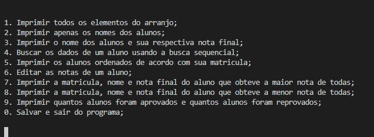

# School Diary
## Descrição do projeto

Este projeto foi desenvolvido com base na proposta de trabalho final da disciplina de Algoritmo e Estrutura de Dados I do curso de Engenharia da computação. O programa tem como objetivo acessar os dados escolares de uma turma a partir um arquivo de texto, oferecer funcionalidades para gerenciar os mesmos e gerar um arquivo atualizado ao encerrar o programa.

  

## 🛠 Tecnologias
- C

## Status do projeto

✅Finalizado.

## Autor

Feito com ❤️ por Rafael Alves

